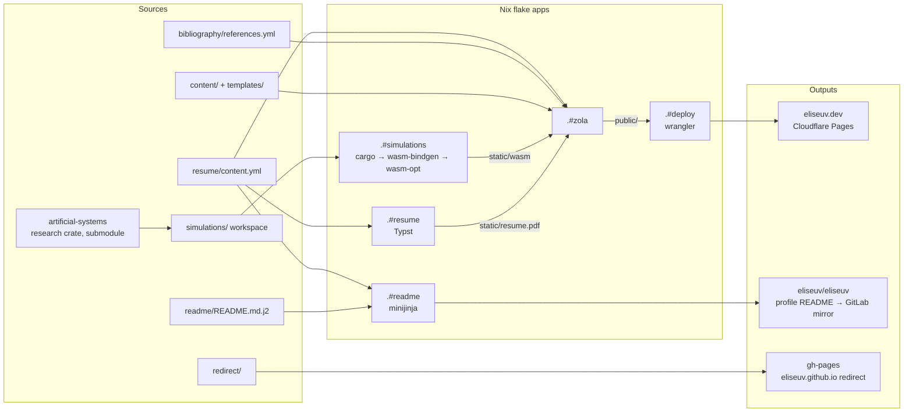

# [eliseuv.dev](https://eliseuv.dev)

My personal website, resume PDF and GitHub profile README, all generated from this
one repository.

## Updating is a push to `main`

Everything here is derived. To add a job, a publication or a project, I edit one
YAML entry. To improve a simulation, I change the Rust code, or bump the research
crate it depends on. Then I push to `main`. CI rebuilds the WebAssembly
simulations, the resume PDF and the site, deploys to Cloudflare Pages, and
regenerates the GitHub profile README. Nothing is built, uploaded or copied
between places by hand, so the site, the PDF and the profile can't drift apart.



## One source of truth

[`resume/content.yml`](resume/content.yml) holds my experience, education,
skills, projects and publications. Every consumer reads it directly:

- **Resume PDF**: [`resume/resume.typ`](resume/resume.typ) loads it with Typst's
  `yaml()` and typesets the PDF that the site serves.
- **Website**: the Zola templates read it through `load_data`. This covers the
  landing page, the full resume at `/resume/`, the project lists and the
  simulation pages. The landing page's own copy is written in its templates
  ([`templates/home/`](templates/home)); names, roles, projects, publications
  and simulations are looked up by id.
- **GitHub profile README**: [`readme/README.md.j2`](readme/README.md.j2) renders
  it with minijinja. The tech-stack badges come from the same skills and
  projects that the resume lists.
- **Citations**: simulation pages cite entries from
  [`bibliography/references.yml`](bibliography/references.yml). My own papers
  are cited by the DOI of a publication in `content.yml`, so a paper is declared
  only once.

Cross-links between experience, education, projects, publications and
simulations are declared once, on one side. Templates derive the reverse
direction. An unknown id fails the build instead of silently dropping a link
(see [`templates/macros/links.html`](templates/macros/links.html)). The site
stays consistent because the build checks it, not because I remember to.

## Simulations run real research code

The [interactive simulations](https://eliseuv.dev/simulations/) are Rust crates in
the [`simulations/`](simulations) Cargo workspace. They are compiled to
`wasm32-unknown-unknown`, bound with `wasm-bindgen` and shrunk with
`wasm-opt -Oz`.

The lattice models are not toy reimplementations written for the web. They call
[`artificial-systems`](https://github.com/eliseuv/artificial-systems), the Rust
crate behind my research on random matrix approaches to correlated time series.
It is included as a git submodule and used as a path dependency. Its default
features are disabled so it builds for the browser, and `getrandom` is routed to
the browser's `crypto.getRandomValues`. So the dynamics running in your browser
are the same code that produces the research results.

| Simulation | Backed by |
| :--- | :--- |
| 2D Ising Model | `artificial-systems` |
| Contact Process | `artificial-systems` |
| Conway's Game of Life | `artificial-systems` |
| Spectral Signatures of Criticality | `artificial-systems` (incl. its spectral analysis) |
| Chiarella Model | `quant` (in-repo) |
| Simulated Annealing for the TSP | `annealing` (in-repo) |

The Spectral Signatures page compares live runs against precomputed reference
scans ([`static/data/spectral/`](static/data/spectral)). The same crate generates
those scans natively with `just generate-spectral-reference`. When the research crate
improves, updating the site means bumping the submodule and pushing. CI checks
out submodules and rebuilds everything.

## Reproducible with Nix

[`flake.nix`](flake.nix) pins the whole toolchain: nixpkgs, a Rust toolchain
with the wasm target (via rust-overlay), Zola, Typst, minijinja, wasm-bindgen,
binaryen and wrangler. Each build step is a flake app:

| App | Does |
| :--- | :--- |
| `nix run .#simulations` | Build every simulation to WASM into `static/wasm/` |
| `nix run .#resume` | Compile the resume PDF into `static/resume.pdf` |
| `nix run .#zola` | Build the site into `public/` |
| `nix run .#readme` | Render the profile README into `public/README.md` |
| `nix run .#deploy` | Upload `public/` to Cloudflare Pages |
| `nix run` | Simulations, resume and site in one go |

CI runs these exact commands, so there is no separate CI toolchain that could
drift from my machine. If it builds locally, it builds in CI. For the same
reason, the site is built in GitHub Actions and sent to Cloudflare Pages by
direct upload instead of through Cloudflare's own Git build, whose image has no
Nix.

## CI pipelines

| Workflow | Trigger | What it does |
| :--- | :--- | :--- |
| [`deploy.yml`](.github/workflows/deploy.yml) | Every push to `main` | Restores the Nix store cache (keyed on `flake.nix`/`flake.lock`), builds simulations → resume → site, deploys to Cloudflare Pages |
| [`profile-readme.yml`](.github/workflows/profile-readme.yml) | Pushes touching `resume/content.yml` or `readme/` | Renders the profile README and commits it to [`eliseuv/eliseuv`](https://github.com/eliseuv/eliseuv), but only if it changed. The push triggers that repo's workflows, which keep its GitLab mirror in sync |
| [`redirect.yml`](.github/workflows/redirect.yml) | Pushes touching `redirect/` | Publishes a redirect stub to `gh-pages` as both `index.html` and `404.html`, so every old `eliseuv.github.io` link lands on eliseuv.dev |

Credentials and private data (Cloudflare token, profile-repo token, phone number)
live only in GitHub secrets. The phone number is injected into the resume at
build time and never committed.

## Local development

```sh
nix develop      # or let direnv load the flake
just dev         # zola serve with live reload
just build       # full build: simulations, resume, site
just --list      # everything else (watch-resume, fmt, clippy, deploy, ...)
```
